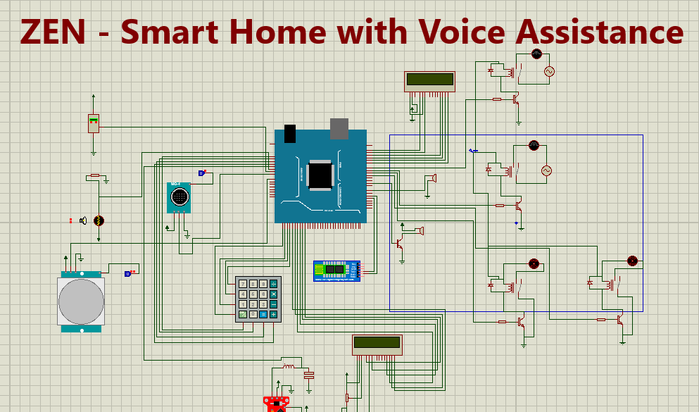

# ZEN - Smart Home with Voice Assistance
Nowadays, houses are going through a swift change to make them more
and more comfortable. Home automation is an example of this. Here, the target
is to build a project where the homeowners can control some of the
appliances of the house, like the fan and the light via their voice. Safety and security
are also emphasized in this project. As such, this project will also have a
fire-alarm in case of fire. Moreover, in this project, the homeowners will
have the authentication system to prevent break-in. Finally, there will also
be a water level sensor for the water tank of the house.

   

## Components
      ● Arduino Mega 
      ● LCD 
      ● Keypad-SmallCalc 
      ● Breadboard 
      ● Gas Sensor 
      ● Buzzer 
      ● Resistor 
      ● Cables and Connectors 
      ● LED 
      ● Diode 
      ● DC Motor 
      ● LDR 
      ● Transistor 
      ● Battery 
      ● Bluetooth Module HC-05 v1 
      ● Capacitor 
      ● Inductor 
      ● Temperature Sensor 
      ● Relay Model 
      ● Water Sensor
   
## Working Procedures
      ● Owner will enter his home by entering a password on the keypad.
      If the password matches, the LCD will show, “Welcome!”. Else,
      after entering the wrong password 3 times, the lcd will show ‘Intruder Alert!!!’ and by using gsm module, message to the owner will be send. And if the user hasn't entered the home but there is any motion detection, alarm will be on.  
      ● There will be voice controlled lights and fans. Users can
      control lights and fans by commanding over an android app. One
      fan will only work if the temperature is below 27 centigrade,
      else both of the fans will work. The same goes for the lights in
      which case both lights will be on if brightness level is low, else only one will work.  
      ● There will be an automated fire alert system, which will detect smoke
      and press the buzzer to alarm people. It will also remove the gas by using the fans.  
      ● There will be an alarm if the water tank of the house gets filled up to
      a high level to save goods and wastage of water.

## Installation

## Future Works
   - SMS and Call-based security using GSM Module.
